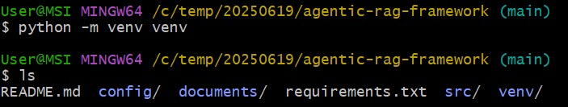

# Project Title
PDF Vector Embedding Pipeline with Supabase

# Description
This project processes PDF documents by loading them from a specified folder, splitting them into text chunks, embedding them using OpenAI's embedding model, and storing the results in a Supabase vector database. The purpose is to create a searchable, vectorized knowledge base from document content, enabling downstream applications such as Retrieval-Augmented Generation (RAG), semantic search, or intelligent Q&A systems.

# Prerequisites
- Python 3.11+

# Installation
## 1. Clone the repository:
- git clone https://github.com/SeahChenKhoon/agentic-rag-framework.git 
- cd agentic-rag-framework


## 2. Create a virtual environment
``` bash
python -m venv venv
```



## 3. Activate the virtual environment
- On Windows
```bash
venv\\Scripts\\activate
```
- Or On Mac
```bash
source venv/bin/activate
```


## 4. Install libraries
```
pip install -r requirements.txt
```


## 5. Create supabase account


## 6. Execute SQL queries in Supabase
- Navigate to SQL Snippet


- Copy the copy SQL statement and paste into the SQL windows
```
-- Enable the pgvector extension to work with embedding vectors
create extension if not exists vector;

-- Create a table to store your documents
create table
  documents (
    id uuid primary key,
    content text, -- corresponds to Document.pageContent
    metadata jsonb, -- corresponds to Document.metadata
    embedding vector (1536) -- 1536 works for OpenAI embeddings, change if needed
  );

-- Create a function to search for documents
create function match_documents (
  query_embedding vector (1536),
  filter jsonb default '{}'
) returns table (
  id uuid,
  content text,
  metadata jsonb,
  similarity float
) language plpgsql as $$
#variable_conflict use_column
begin
  return query
  select
    id,
    content,
    metadata,
    1 - (documents.embedding <=> query_embedding) as similarity
  from documents
  where metadata @> filter
  order by documents.embedding <=> query_embedding;
end;
$$;
```
- Execute the SQL statements


## 7. Add API keys to .env file
- Rename example.env to .env
```
cp example.env .env
```
- Add the API keys for Supabase and OpenAI to the .env file


## Executing the scripts
- Open a terminal in VS Code
- Execute the following command:

  - PYTHONPATH=. python .//src//embed_documents_to_supabase.py

  

  - PYTHONPATH=. streamlit run ./src/agentic_rag_streamlit_app.py

  
  


